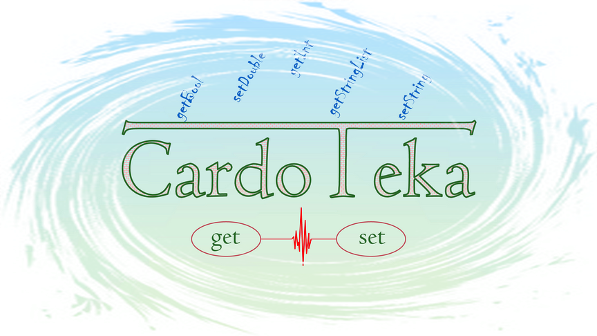

[![telegram_badge]][telegram_link]
[![pub_badge]][pub_link]

In progress...

<!-- TOC -->
  * [How to use?](#how-to-use)
  * [How to use with Riverpod?](#how-to-use-with-riverpod)
  * [How to implement key storage?](#how-to-implement-key-storage)
      * [There are several ways to avoid this mistake.](#there-are-several-ways-to-avoid-this-mistake)
  * [TODO](#todo)
  * [TODO implement](#todo-implement)
  * [Additional information](#additional-information)
  * [The structure of the library](#the-structure-of-the-library)
<!-- TOC -->

## How to use?

1. Define your cards: specify the type to be stored and the default value. Additionally, specify converters if the value type cannot be represented in the existing `DataType` enumeration:

```dart
import 'package:cardoteka/cardoteka.dart';
import 'package:flutter/material.dart' hide Card;

enum SettingsCards<T extends Object> implements Card<T> {
   userColor(DataType.int, Color(0x00FF4BFF)),
   themeMode(DataType.string, ThemeMode.light),
   isPremium(DataType.bool, false),
   ;

   const SettingsCards(this.type, this.defaultValue);

   @override
   final DataType type;

   @override
   final T defaultValue;

   @override
   String get key => name;

   static Map<SettingsCards, Converter> get converters => const {
      themeMode: EnumAsStringConverter(ThemeMode.values),
      userColor: Converters.colorAsInt,
   };
}

```

2. Define storage for cards and mix in functionality as you see fit:

```dart
class SettingsCardoteka extends Cardoteka with WatcherImpl {
  SettingsCardoteka({required super.config});
}
```

3. Perform initialization (once) via `Cardoteka.init` and take advantage of all the features of your cardoteka: save, read, delete, listen to your saved data using typed cards:

```dart
main() async {
  await Cardoteka.init();
  final cardoteka = SettingsCardoteka(
    config: CardConfig(
      name: 'settings',
      cards: SettingsCards.values,
      converters: SettingsCards.converters,
    ),
  );

  final log = StringBuffer('All notifications for SettingsCards.themeMode:\n');
  cardoteka.attach(
    SettingsCards.themeMode,
    (value) => log.writeln('-> $value'),
    onRemove: () => log.writeln('-> has been removed from storage'),
    detacher: (onDetach) {
      // pass onDetach to whoever is responsible for the lifetime of the object
    },
  );

  ThemeMode themeMode = cardoteka.get(SettingsCards.themeMode);
  print(themeMode); // will return default value -> ThemeMode.light

  await cardoteka.set(SettingsCards.themeMode, ThemeMode.dark); // first log
  themeMode = cardoteka.get(SettingsCards.themeMode);
  print(themeMode); // ThemeMode.dark

  // you can use generic type to prevent possible errors when passing arguments
  // of different types
  await cardoteka.set<bool>(SettingsCards.isPremium, true);
  await cardoteka.set<Color>(SettingsCards.userColor, Colors.deepOrange);

  await cardoteka.remove(SettingsCards.themeMode); // second log
  Map<Card<Object?>, Object> storedEntries = cardoteka.getStoredEntries();
  print(storedEntries);
  // {
  //   SettingsCards.userColor: Color(0xffff5722),
  //   SettingsCards.isPremium: true
  // }

  await cardoteka.removeAll(); // third log
  storedEntries = cardoteka.getStoredEntries();
  print(storedEntries); // {}

  print(log); // All notifications for SettingsCards.themeMode:
  // -> ThemeMode.dark
  // -> has been removed from storage
  // -> has been removed from storage
}
```

**Don't worry!** If you do something wrong, you will receive a detailed correction message in the console.

## Use with...

All the most up-to-date examples can be found in the [example/lib](https://github.com/PackRuble/cardoteka/tree/dev/example) folder of this project. Here are just some simple practices to use with different tools.

### ChangeNotifier

You will need a notifier (by the way, stop expanding on it. Use `with` instead of `extends`) and one helper method for assembling callbacks for later calling them when the notifier is disposed. For now, you can implement this yourself as a mixin:

```dart
mixin CardotekaDetacher on ChangeNotifier {
  List<VoidCallback>? _onDisposeCallbacks;

  void onDispose(void Function() cb) {
    _onDisposeCallbacks ??= [];
    _onDisposeCallbacks!.add(cb);
  }

  @override
  void dispose() {
    _onDisposeCallbacks?.forEach((cb) => cb.call());
    _onDisposeCallbacks = null;

    super.dispose();
  }
}
```

This feature "from the package" will be implemented later. Now you can take part in the discussion (🥺) of the API of this aspect.

[//]: # (todo: link on issue)

Now you can define your notifier with the required number of states and then `attach` a wiretap (you can attach as many wiretaps to the card as you like):

```dart
class OrderNotifier with ChangeNotifier, CardotekaDetacher {
  final _orders = <String>[];

  void addOrder(String value) {
    _orders.add(value);
    notifyListeners();
    print('New order: $value');
  }
}

class CardotekaImpl = Cardoteka with WatcherImpl;

void main() {
   // to do: initialize
   CardotekaImpl? cardoteka;
   Card<String>? lastOrderCard;

   final notifier = OrderNotifier();
   cardoteka!.attach(
      lastOrderCard!,
      notifier.addOrder,
      detacher: notifier.onDispose,
   );

   cardoteka.set(lastOrderCard, '#341');
   // 1. a value was saved to storage
   // 2. console-> New order: #341
}
```

### ValueNotifier

Everything is very similar (and not surprising, heh) to the example with `ChangeNotifier`. However, let's implement this in a concrete class:

```dart
class CurrentTaskNotifier extends ValueNotifier {
  CurrentTaskNotifier(super.task);

  VoidCallback? _onDetach;

  void onDispose(void Function() cb) => _onDetach = cb;

  @override
  void dispose() {
    _onDetach?.call();
    super.dispose();
  }
}
```

Now all the same ingredients, but let's also add the `fireImmediately` flag to get the actual value in our notifiers at once:

```dart
class CardotekaImpl = Cardoteka with WatcherImpl;

void main() {
  // to do: initialize
  CardotekaImpl? cardoteka;
  Card<String>? card; // with default value = 'nothing to do now'

  final notifier = CurrentTaskNotifier('');
  cardoteka!.attach(
    card!,
    (value) {
      notifier.value = value;
      print('New case: $value');
    },
    detacher: notifier.onDispose, // attention to this line
    fireImmediately: true, // callback will fire immediately
  );

  cardoteka.set(card, 'new case available!');
  // 1. console-> nothing to do now
  // 2. a value was saved to storage
  // 3. console-> New case: new case available!
}
```

However, if you don't like throwing empty values (perhaps adhering to the "don't use magic constants" principle), then use this option (fully equivalent):

```dart
  final notifier = CurrentTaskNotifier(card.defaultValue);
  cardoteka.attach(
    card,
    (value) {
      notifier.value = value;
      print('New case: $value');
    },
    detacher: notifier.onDispose,
  );
```

## OLD Readme 

1. Identify the DB object with the necessary mixins (optional)
   ```dart
   class DbUser extends RDatabase with CRUD, Watcher {}
   ```
2. Define your key list. Read more about all methods [here](#how-to-implement-key-storage)
   ```dart
   enum KeyStore<T> implements RKey<T> {
     banana<int>(TypeSaved.int, 5),
     melon<int?>(TypeSaved.int, 44),
     cucumber<int>(TypeSaved.int, -3),
     watermelon<int>(TypeSaved.int, 2),
     ;
   
     const KeyStore(this.type, this.defaultValue);
   
     @override
     final TypeSaved type;
   
     @override
     final T defaultValue;
   
     @override
     String get key => name;
   }
   ```

3. Initialize the database:
   ```dart
   final DbUser db = DbUser();
   await db.init(KeyStore.values);
   ```
4. Execute requests:
```dart
   // If there is no value, it will return the default value.
   // Will always return the type specified in the key.
   final banana = db.get(KeyStore.banana);
   print(banana);
   
   // You can specify [ifAbsent] if you want to return your value
   // instead of [defaultValue] in case the key is absent in the database.
   final bananaNull = db.get(KeyStore.banana, () => null);
   print(bananaNull);
   
   // When you save a new value to the database, be sure to specify the generic type.
   db.set(KeyStore.banana, 5); // says it's not a mistake (it's really not a mistake)
   db.set(KeyStore.banana, 'mistake!'); // says it's not a mistake
   db.set(KeyStore.banana, true); // says it's not a mistake
   db.set<int>(KeyStore.banana, 5); // right call
   db.set<int>(KeyStore.banana, 'mistake!'); // a mistake
   db.set<bool>(KeyStore.banana, true); // a mistake (KeyStore.banana is int type)
```

## How to use with Riverpod?
Use mixin `Watcher` and method `listen`
```dart

class DbUser extends RDatabase with Watcher {}

final db = Provider<DbUser>((ref) => DbUser());

// Note: if the value is absent in the database, the default value will be returned. 
// Pass also parameter onDispose if provider can be disposed. This will free up 
// related resources
final bananaProvider = Provider.autoDispose<int>((ref) {
    return ref.watch(db).listen<int>(
          KeyStore1.banana,
          (value) => ref.state = value,
          ref.onDispose,
        );
  });
```

And now we save the data to the database by our key  `KeyStore1.banana` using method:
```dart
// You can either pass ref as a parameter or use a class where that ref is an
// initialized field.
void saveValue(int value) =>
      ref.read(db).set(KeyStore1.banana, value);
```

As a result, the new value will be saved in the database `DbUser` and the provider `bananaProvider` will be automatically updated.

## How to implement key storage?

To create a key store, you need to use the `RKey` implementation.

The simplest way is to create an `Enum` of this form:
```dart
enum KeyStore<T> implements RKey<T> {
  carrot<int>(TypeSaved.int, 55),
  apple<int>(TypeSaved.int, 20),
  basket<String>(TypeSaved.string, 'Wooden basket'),
  // ...add what you need to keep
  ;

  const KeyStore(this.type, this.defaultValue);

  @override
  final TypeSaved type;

  @override
  final T defaultValue;

  @override
  String get key => name; // pay attention
}
```

This method assumes that the names of the `Enum` instances (e.g. `carrot`) will NEVER be changed. Otherwise, we will lose our data that was previously saved under this name.

#### There are several ways to avoid this mistake.
1. Always use custom keys for all objects:
    ```dart
    enum KeyStore<T> implements RKey<T> {
        ...
    [-] apple<int>(TypeSaved.int, 20),
    [+] apple<int>(TypeSaved.int, 20, 'custom key for carrot'),
      
        ...
    [-] const KeyStore(this.type, this.defaultValue);
    [+] const KeyStore(this.type, this.defaultValue, this.key);
    
        ...
    [-] String get key => name;
    [+] final String key;
    }
    ```

2. Use custom keys as needed:
    ```dart
   enum KeyStore<T> implements RKey<T> {
       ...
       carrot<int>(TypeSaved.int, 55),
       apple<int>(TypeSaved.int, 20, 'apple's need keys'),
 
   ...
   [-] const KeyStore(this.type, this.defaultValue);
   [+] const KeyStore(this.type, this.defaultValue, [this._key]);
   
   ...
   [+] final String? _key;
   
   ...
   [-] String get key => name;
   [+] String get key => _key ?? name;
   }
   ```

3. Add a key migration map and use the `@Deprecated('message')` annotation:
   ```dart
   ...
   @Deprecated(
    '`apple` are outdated. Use `greenApple` instead. '
    'For more information, consult the migration guide at .... '
    'This instance will be removed with the v3.0.0 release',
   )
   apple<int>(TypeSaved.int, 20),

   greenApple<int>(TypeSaved.int, 20),
   ...
   ```
   And add `{KeyStore.apple: KeyStore.greenApple}` in `Map<RKey, RKey>? migrator` to class `DbBase.init()` (in development).

With the help of a `class`, this can be done like this:
```dart
class KeyStore2<T> implements RKey<T> {
  static const carrot = KeyStore2<int>._(TypeSaved.int, 55, 'carrot');
  static const apple = KeyStore2<int>._(TypeSaved.int, 20, 'apple');
  static const gardenLocation = KeyStore2<String>._(
      TypeSaved.string, 'To the left of the lake', 'gardenLocation');

  static const List<KeyStore2> values = [carrot, apple, gardenLocation];

  const KeyStore2._(this.type, this.defaultValue, this.key);

  @override
  final TypeSaved type;

  @override
  final T defaultValue;

  @override
  final String key;
}
```

## TODO
1. [ ] Add info about watchers
2. [ ] Add info about operation instrument
3. [ ] Add info about converters and complex objects
4. [ ] Add info about supported types
5. [ ] Add info uses migrator

## TODO implement
1. [ ] Migrator of data
2. [ ] To implement other converters, e.g. DateTimeConverter, Color, Enum, Map, Set
3. [ ] Tests
4. [ ] License

## Additional information

This project is under development and is actively 'undergoing combat' tests in applications

## The structure of the library


[telegram_badge]: https://img.shields.io/badge/Telegram%20channel-❤️-FEBE8C?style=plastic&logo=telegram
[telegram_link]: https://t.me/+AkGV73kZi_Q1YTMy

[pub_badge]: https://img.shields.io/pub/v/cardoteka.svg?style=plastic
[pub_link]: https://pub.dev/packages/cardoteka